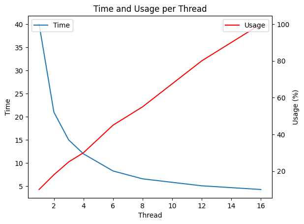
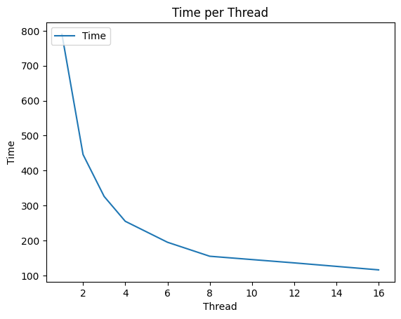

# Benchmark

***Benchmark are set to quicly evolve. I have currently multiple ideas to improve perf***

## Command

You can run `zig build benchmark` if you clone the repo to benchmark your machine.

Here an example on my machine:

```
=====================================

Populating with 500000 users.
Populate duration: 8.605314 seconds

Database path: benchmark
Total size: 50.99Mb
LOG: 0.00Mb
BACKUP: 0.00Mb
DATA: 50.93Mb
  User: 50.92683124542236Mb 500000 entities

--------------------------------------

Query:          GRAB User {}
Duration:       457.758686 ms

Query:          GRAB User [1] {}
Duration:       1.285849 ms

Query:          GRAB User [name] {}
Duration:       138.041888 ms

Query:          GRAB User {name = 'Charlie'}
Duration:       63.094060 ms

Query:          GRAB User {age > 30}
Duration:       335.654647 ms

Query:          GRAB User {bday > 2000/01/01}
Duration:       52.896498 ms

Query:          GRAB User {age > 30 AND name = 'Charlie' AND bday > 2000/01/01}
Duration:       56.295173 ms

Query:          GRAB User {best_friend IN {name = 'Charlie'}}
Duration:       69.165272 ms

Query:          DELETE User {}
Duration:       93.530622 ms

=====================================
```

## File Parsing

In this example I create a random dataset of Users using this schema:
```lua
User (
  name: str,
  age: int,
  email: str,
  bday: date,
  last_order: datetime,
  a_time: time,
  scores: []int,
  friends: []str,
)
```

Here a user example:
```lua
run "ADD User (name = 'Diana Lopez',age = 2,email = 'allisonwilliams@example.org',scores=[37 85 90 71 88 85 68],friends = [],bday=1973/11/13,last_order=1979/07/18-15:05:26.590261,a_time=03:04:06.862213)
```

Let's do a query that parse all file but dont return anything, so we have the time to read and evaluate file but not writting and sending output.
```lua
run "GRAB User {name = 'asdfqwer'}"
```

## 50 000 000 Users
This take 6.24GB space on disk.

| Thread | Time (s) | Usage (%) |
| --- | --- | --- |
| 1 | 40 | 10 |
| 2 | 21 | 18 |
| 3 | 15 | 25 |
| 4 | 12 | 30 |
| 6 | 8.3 | 45 |
| 8 | 6.6 | 55 |
| 12 | 5.1 | 85 |
| 16 | 4.3 | 100 |



## 1 000 000
This take 127MB space on disk, sperated into 24 files of 5.2MB

| Thread | Time (ms) | 
| --- | --- | 
| 1 | 790 | 
| 2 | 446 | 
| 3 | 326 | 
| 4 | 255 | 
| 6 | 195 | 
| 8 | 155 | 
| 12 | 136 | 
| 16 | 116 | 



